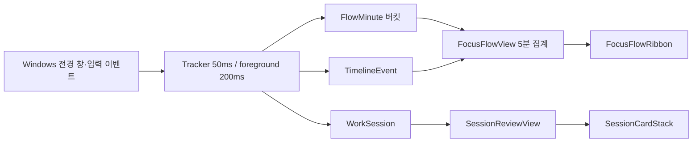

# FlowLens P0 집중 경험 UI 설계

**대상 기능:** 집중 흐름 리본, 집중 세션 카드  
**대상 릴리스:** v0.6.0 제안  
**작성일:** 2026-09-17  
**작성자:** Manus AI

## 결론

P0 화면은 사용자의 생산성이나 건강 상태를 점수화하지 않는다. 대신 **하루 동안 흐름이 유지된 구간, 전환이 많았던 구간, 유휴로 전환된 구간**을 시간축으로 설명한다. 이를 위해 UI는 다음 두 개의 읽기 모델만 소비한다.

1. **`FocusFlowView`**는 5분 버킷으로 압축된 집중·유휴·전환 데이터를 제공한다. 이 모델은 집중 흐름 리본에 사용한다.
2. **`SessionReviewView`**는 완료 세션과 진행 중 세션을 같은 형식으로 정규화한다. 이 모델은 집중 세션 카드에 사용한다.

현재 `TrackingState`에는 분당 누적 스냅샷, 앱 전환 이벤트, 완료 세션 및 진행 중 세션 상태가 존재한다. 그러나 누적 스냅샷만으로는 특정 5분 구간의 상태를 신뢰성 있게 재현하기 어렵다. 따라서 v0.6.0부터는 수집기에서 **분 단위 원시 흐름 버킷**을 직접 기록하고, Tauri 명령이 이를 5분 단위 읽기 모델로 변환하는 구성이 적절하다.[1]

> **표현 원칙:** 리본과 카드는 “집중 상태”, “전환 밀도”, “세션 구조”를 표시한다. “피로”, “집중력 저하”, “성과”처럼 의학적 또는 평가적 표현은 사용하지 않는다.

## 범위와 비범위

P0는 오늘의 흐름을 표시한다. 날짜 선택, 주간 비교, 앱 카테고리 매핑, 알림·ETW·앱별 네트워크 수집은 후속 단계로 분리한다. 지금 구현된 2초 폴링 기반의 전체 상태 갱신은 유지할 수 있지만, P0 패널은 필요한 작은 뷰 모델만 별도 IPC로 받아야 한다.[2]

| 항목 | P0 포함 | 이유 |
|---|---:|---|
| 오늘의 5분 흐름 버킷 | 예 | 리본을 명확하고 가볍게 렌더링할 수 있음 |
| 집중·유휴·전환 상태 | 예 | 현재 입력·유휴·전환 수집과 직접 연결됨 |
| 완료 세션과 진행 중 세션 | 예 | 세션 구조를 즉시 보여 줄 수 있음 |
| 세션별 앱 개수와 전환 수 | 예 | 현재 `WorkSession`에 이미 집계됨 |
| 세션별 앱 이름·창 제목 | 아니오 | P0 카드의 목적에 불필요하며 민감정보 노출을 줄임 |
| 개인 기준선 대비 | 아니오 | 현재 P0는 당일 설명에 집중하며, P1에서 임베딩 이력과 결합 |
| 알림·앱별 네트워크 원인 오버레이 | 아니오 | 추가 권한이 필요한 별도 수집기 범위임 |
| 피로도·생산성 단일 점수 | 아니오 | 해석 과잉 및 잘못된 평가를 방지함 |

## 데이터 계층과 변경 방향

현재 데이터는 `활성 창 추적 → 타임라인 및 분당 누적 스냅샷 → 일일 특징 벡터` 순서로 저장된다. 활성 창은 200ms 간격으로 HWND, PID, 실행 파일명 조합으로 확인한다. 이 방식은 제목 없는 창과 짧은 활성화의 누락을 줄인다.[1] [3]

P0는 기존 데이터에 의존하되, 리본 전용의 작은 집계 계층을 하나 더 둔다.



### 새 저장 모델: `FlowMinute`

`FlowMinute`은 분당 누적값인 기존 `MinuteSnapshot`을 대체하지 않는다. 리본을 위한 **구간 데이터**를 별도로 기록한다. 분당 누적 스냅샷은 기존 대시보드와 호환성을 위해 유지하고, `FlowMinute`은 UI 전용의 로컬 읽기 원본이 된다.

```rust
#[derive(Clone, Serialize, Deserialize, Default)]
#[serde(default)]
struct FlowMinute {
    // 해당 로컬 분의 시작 시각. 예: 2026-09-17T14:35:00+09:00
    start_at: String,
    observed_seconds: u16,
    focus_seconds: u16,
    idle_seconds: u16,
    switch_count: u16,
    keyboard_actions: u32,
    mouse_actions: u32,
    mouse_distance_px: f32,
}
```

`FlowMinute`에는 창 제목, URL, 키 입력 내용, 마우스 절대 좌표, 프로세스 명령줄을 저장하지 않는다. 앱 이름도 P0 리본 데이터에는 포함하지 않는다. 이로써 리본의 시각적 상태는 로컬 집계 정보만으로 구성된다.

### 수집기 바인딩 규칙

`start_tracker`의 기존 이벤트 지점에 아래 갱신을 추가한다. 이 규칙은 누적값의 차이를 나중에 추정하는 방식보다 재시작·부분 분·현재 진행 중 구간을 정확히 다룬다.

| 기존 수집 지점 | `FlowMinute` 변경 | 설명 |
|---|---|---|
| 50ms 입력 루프에서 키 입력 감지 | `keyboard_actions += key_presses` | 키 내용은 저장하지 않음 |
| 50ms 입력 루프에서 마우스 이동/클릭 감지 | `mouse_actions`, `mouse_distance_px` 증가 | 좌표 대신 거리만 저장 |
| 200ms 전경 창 전환 감지 | `switch_count += 1` | 앱 식별자는 흐름 버킷에 저장하지 않음 |
| 1초 활동 판정 | `observed_seconds += 1`, 그리고 `focus_seconds` 또는 `idle_seconds` 증가 | 5분 유휴 임계값은 기존 규칙을 유지 |
| 날짜 전환 및 전체 데이터 삭제 | 해당 날짜 버킷 초기화 또는 파일 삭제 | 기존 로컬 삭제 경계와 동일하게 동작 |

권장 상한은 `MAX_FLOW_MINUTES = 1,440`이다. P0가 오늘만 표현하므로 하루 1,440개 분 단위 원본이면 충분하다. 기존 `clear_all_data`는 새 버킷도 포함해 `activity.json`을 제거해야 한다.[1]

## IPC 읽기 모델

프론트엔드가 `TrackingState` 전체를 매번 해석하지 않도록, 단일 Tauri 명령을 추가한다.

```rust
#[tauri::command]
fn get_focus_experience_view(
    date: String,
    bucket_minutes: u8,
    state: tauri::State<'_, SharedState>,
) -> Result<FocusExperienceView, String>;
```

P0에서는 `date`를 현재 로컬 날짜로 제한하고 `bucket_minutes = 5`만 허용한다. 날짜 선택 기능이 추가되면 동일 명령의 계약을 유지하면서 저장 범위만 확장한다.

```rust
#[derive(Clone, Serialize)]
struct FocusExperienceView {
    schema_version: u32,
    date: String,
    generated_at: String,
    is_live: bool,
    ribbon: FocusFlowView,
    sessions: SessionReviewView,
}

#[derive(Clone, Serialize)]
struct FocusFlowView {
    bucket_minutes: u8,
    day_start_at: String,
    day_end_at: String,
    buckets: Vec<FocusFlowBucketView>,
    summary: FocusFlowSummary,
}

#[derive(Clone, Serialize)]
struct FocusFlowBucketView {
    start_at: String,
    end_at: String,
    state: String, // unobserved | focused | switching | idle | mixed
    observed_seconds: u16,
    focus_seconds: u16,
    idle_seconds: u16,
    switch_count: u16,
    input_actions: u32,
    intensity: f32, // 0.0..1.0, 색의 명도·두께만 결정
}

#[derive(Clone, Serialize)]
struct FocusFlowSummary {
    focus_seconds: u64,
    idle_seconds: u64,
    longest_focused_span_seconds: u64,
    highest_switch_bucket_start_at: Option<String>,
    highest_switch_count: u16,
}

#[derive(Clone, Serialize)]
struct SessionReviewView {
    sessions: Vec<SessionCardView>,
    summary: SessionSummary,
}

#[derive(Clone, Serialize)]
struct SessionCardView {
    id: String,
    started_at: String,
    ended_at: Option<String>,
    is_live: bool,
    status: String, // focused | steady | fragmented | brief
    active_seconds: u64,
    app_count: u64,
    switch_count: u64,
    switches_per_active_hour: f32,
    end_reason: Option<String>, // idle | tracking_paused | day_rollover
}

#[derive(Clone, Serialize)]
struct SessionSummary {
    completed_count: u64,
    active_seconds: u64,
    longest_session_seconds: u64,
    average_session_seconds: u64,
}
```

### 상태 분류 규칙

상태 분류는 화면 표현만 위한 규칙이다. 결과를 개인 능력이나 건강 상태로 해석하지 않는다. 모든 임계값은 상수로 한 곳에 정의하고, P1에서 사용자가 조정할 수 있게 한다.

| `FocusFlowBucketView.state` | 판정 규칙 | 리본 표현 | 의미 |
|---|---|---|---|
| `unobserved` | `observed_seconds < 30` | 낮은 대비의 빈 칸 | 앱이 꺼져 있었거나 해당 시간대 데이터가 없음 |
| `idle` | `idle_seconds / observed_seconds >= 0.60` | 회색 점선 | 유휴 임계값을 넘긴 시간이 우세함 |
| `switching` | 5분 전환 수 `>= 4` 또는 분당 전환 수가 0.8 이상 | 주황색 가는 리본 | 전환이 밀집된 구간 |
| `focused` | 집중 비율 `>= 0.75`이고 전환 수 `<= 2` | 보라색 굵은 리본 | 비교적 연속적인 활동 구간 |
| `mixed` | 나머지 관측 구간 | 파란색 중간 리본 | 활동은 있으나 한 상태로 단정하기 어려움 |

`intensity`는 `focus_seconds`, 입력 행동 수의 로그 정규화, 낮은 전환 수를 가중합해 0~1로 제한한다. 예시는 아래와 같다.

```text
focusRatio = focusSeconds / max(observedSeconds, 1)
inputDensity = min(1, ln(1 + inputActions) / ln(1 + 120))
switchPenalty = min(1, switchCount / 6)
intensity = clamp(0.65 * focusRatio + 0.25 * inputDensity + 0.10 * (1 - switchPenalty), 0, 1)
```

세션 상태는 더 간단하게 유지한다. 25분 이상이며 활성 1시간당 전환이 6회 미만이면 `focused`, 15분 이상이며 전환이 12회 미만이면 `steady`, 그 외 전환 밀도가 높거나 평균보다 짧으면 `fragmented`, 10분 미만이면 `brief`로 표시한다. `fragmented`는 부정 평가가 아니라 **짧거나 전환이 많은 세션 구조**라는 설명을 동반해야 한다.

## 프론트엔드 컴포넌트 구조

P0 패널은 기존 `App`에서 개별 JSX를 계속 확장하지 않고, 별도의 `src/features/focus-experience/` 모듈로 분리한다. 이렇게 하면 리본 렌더링 상태, 선택된 구간, 툴팁, 세션 카드 정렬이 메인 대시보드 상태와 섞이지 않는다.

```text
src/
  features/
    focus-experience/
      types.ts
      useFocusExperience.ts
      focusExperienceAdapters.ts
      FocusExperiencePanel.tsx
      FocusFlowRibbon.tsx
      FocusFlowSegment.tsx
      FlowBucketTooltip.tsx
      FlowDetailDrawer.tsx
      SessionCardStack.tsx
      SessionCard.tsx
      focusExperience.css
```

### 상위 패널

```tsx
type FocusExperiencePanelProps = {
  date: string;
  trackingEnabled: boolean;
};

function FocusExperiencePanel({ date, trackingEnabled }: FocusExperiencePanelProps) {
  const { data, loading, error, refresh } = useFocusExperience({
    date,
    bucketMinutes: 5,
    pollMs: trackingEnabled ? 5_000 : 0,
  });

  if (loading && !data) return <FocusExperienceSkeleton />;
  if (error && !data) return <FocusExperienceUnavailable onRetry={refresh} />;
  if (!data) return null;

  return (
    <section className="focus-experience" aria-label="오늘의 집중 흐름">
      <FocusFlowRibbon ribbon={data.ribbon} isLive={data.is_live} />
      <SessionCardStack sessions={data.sessions} isLive={data.is_live} />
    </section>
  );
}
```

`FocusExperiencePanel`은 IPC 호출, 로딩 상태, 오류 재시도, 5초 갱신만 담당한다. 리본과 세션 카드는 `FocusExperienceView`만 받으며 `TrackingState`에 직접 접근하지 않는다.

### 집중 흐름 리본 트리

```text
FocusFlowRibbon
├── PanelHeader
│   ├── 제목: 오늘의 집중 흐름
│   ├── 요약: 집중 시간·최장 연속 흐름·가장 전환이 많은 구간
│   └── 현재 갱신 상태: 실제 추적 중 / 일시 정지
├── RibbonLegend
│   ├── 집중 흐름
│   ├── 전환 밀집
│   ├── 유휴
│   └── 데이터 없음
├── RibbonViewport
│   ├── HourGrid
│   ├── FocusFlowSegment × 288
│   └── CurrentTimeMarker
├── FlowBucketTooltip
└── FlowDetailDrawer
```

`RibbonViewport`는 24시간을 288개의 5분 칸으로 나눈 CSS Grid를 사용한다. SVG나 차트 라이브러리는 P0에서 필요하지 않다. 288개의 접근 가능한 버튼은 데스크톱 Tauri 환경에서 충분히 가볍고, 각 구간을 키보드로 선택할 수 있다.

```tsx
type FocusFlowRibbonProps = {
  ribbon: FocusFlowView;
  isLive: boolean;
};

function FocusFlowRibbon({ ribbon, isLive }: FocusFlowRibbonProps) {
  const [selected, setSelected] = useState<FocusFlowBucketView | null>(null);
  const [hovered, setHovered] = useState<FocusFlowBucketView | null>(null);

  return (
    <article className="panel flow-ribbon-panel">
      <FlowRibbonHeader summary={ribbon.summary} isLive={isLive} />
      <RibbonLegend />
      <div className="ribbon-scroll" aria-label="24시간 집중 흐름 시간축">
        <div className="ribbon-grid" role="list">
          {ribbon.buckets.map((bucket) => (
            <FocusFlowSegment
              key={bucket.start_at}
              bucket={bucket}
              selected={selected?.start_at === bucket.start_at}
              onFocus={() => setHovered(bucket)}
              onHover={() => setHovered(bucket)}
              onSelect={() => setSelected(bucket)}
            />
          ))}
          {isLive && <CurrentTimeMarker dayStartAt={ribbon.day_start_at} />}
        </div>
      </div>
      <FlowBucketTooltip bucket={hovered} />
      <FlowDetailDrawer bucket={selected} onClose={() => setSelected(null)} />
    </article>
  );
}
```

### 리본 세그먼트

각 세그먼트는 5분만 나타낸다. 세그먼트의 폭은 시간 비율로 고정하고, `intensity`는 리본 높이와 불투명도를 결정한다. 상태 색상만으로 판단을 강제하지 않도록, 스크린리더와 툴팁에 상태 텍스트와 근거를 함께 제공한다.

```tsx
function FocusFlowSegment({ bucket, selected, onFocus, onHover, onSelect }: SegmentProps) {
  const label = formatBucketAriaLabel(bucket);
  return (
    <button
      type="button"
      className={`flow-segment ${bucket.state} ${selected ? 'selected' : ''}`}
      style={{ '--intensity': bucket.intensity } as React.CSSProperties}
      aria-label={label}
      aria-pressed={selected}
      onFocus={onFocus}
      onMouseEnter={onHover}
      onClick={onSelect}
    />
  );
}
```

`formatBucketAriaLabel`의 결과는 “14시 05분부터 14시 10분, 집중 흐름, 집중 4분, 앱 전환 1회”처럼 생성한다. 색상만으로 상태를 구분하지 않으며, `focused`는 굵은 실선, `switching`은 얇은 대각선 패턴, `idle`은 점선, `unobserved`는 낮은 대비 패턴을 함께 사용한다.

### 집중 세션 카드 트리

```text
SessionCardStack
├── PanelHeader
│   ├── 제목: 집중 세션
│   └── 요약: 완료 세션 수·최장 세션·총 활성 시간
├── SessionCard × 최대 5
│   ├── 상태 배지
│   ├── 시작·종료 시각 또는 진행 중 표시
│   ├── 활성 시간
│   ├── 앱 개수
│   ├── 전환 횟수 및 시간당 전환 수
│   └── 세션 설명
├── ShowMoreButton
└── EmptyState
```

P0는 최신 세션을 위에 두고 기본 5개만 표시한다. 더 보기 버튼은 동일 패널 안에서 완료 세션 전체를 펼친다. 세션 하나를 클릭하면 리본이 해당 시간 범위를 강조하도록 `selectedSessionId`를 상위 상태로 올린다.

```tsx
type SessionCardStackProps = {
  sessions: SessionReviewView;
  isLive: boolean;
};

function SessionCardStack({ sessions, isLive }: SessionCardStackProps) {
  const [expanded, setExpanded] = useState(false);
  const cards = expanded ? sessions.sessions : sessions.sessions.slice(0, 5);

  return (
    <article className="panel session-card-panel">
      <SessionCardHeader summary={sessions.summary} />
      {cards.length === 0 ? (
        <SessionEmptyState />
      ) : (
        <ol className="session-card-list">
          {cards.map((session) => <SessionCard key={session.id} session={session} isLive={isLive} />)}
        </ol>
      )}
      {sessions.sessions.length > 5 && (
        <button className="mini-btn" onClick={() => setExpanded((value) => !value)}>
          {expanded ? '접기' : `세션 ${sessions.sessions.length - 5}개 더 보기`}
        </button>
      )}
    </article>
  );
}
```

`SessionCard`에는 앱 이름이나 창 제목을 넣지 않는다. 카드 목적은 개인이 한 세션의 구조를 이해하도록 돕는 것이지, 원본 작업 내용을 다시 보여 주는 것이 아니다.

```tsx
function SessionCard({ session, isLive }: { session: SessionCardView; isLive: boolean }) {
  return (
    <li className={`session-card status-${session.status}`}>
      <div className="session-card-topline">
        <SessionStatusBadge status={session.status} />
        <time>{formatSessionRange(session.started_at, session.ended_at, session.is_live && isLive)}</time>
      </div>
      <strong>{formatDuration(session.active_seconds)} 활동 세션</strong>
      <div className="session-facts">
        <span>{session.app_count}개 앱</span>
        <span>전환 {session.switch_count}회</span>
        <span>시간당 {session.switches_per_active_hour.toFixed(1)}회</span>
      </div>
      <p>{describeSession(session)}</p>
    </li>
  );
}
```

`describeSession`은 상태를 설명 가능한 문장으로 변환한다. 예를 들어 `focused`는 “25분 이상 활동했고 앱 전환이 적은 연속 구간입니다.”, `fragmented`는 “짧은 활동 또는 전환이 반복된 구간입니다.”라고 표시한다. “좋음”, “나쁨”, “피로” 같은 평가 단어는 사용하지 않는다.

## TypeScript 바인딩 계약

`src/features/focus-experience/types.ts`는 Rust 직렬화 키와 동일한 snake_case를 사용한다. 기존 코드가 이미 Tauri에서 snake_case 객체를 받으므로, P0에서 별도 키 변환 계층은 필요하지 않다.[2]

```ts
export type FlowState = 'unobserved' | 'focused' | 'switching' | 'idle' | 'mixed';
export type SessionStatus = 'focused' | 'steady' | 'fragmented' | 'brief';

export type FocusFlowBucketView = {
  start_at: string;
  end_at: string;
  state: FlowState;
  observed_seconds: number;
  focus_seconds: number;
  idle_seconds: number;
  switch_count: number;
  input_actions: number;
  intensity: number;
};

export type FocusFlowView = {
  bucket_minutes: number;
  day_start_at: string;
  day_end_at: string;
  buckets: FocusFlowBucketView[];
  summary: {
    focus_seconds: number;
    idle_seconds: number;
    longest_focused_span_seconds: number;
    highest_switch_bucket_start_at?: string;
    highest_switch_count: number;
  };
};

export type SessionCardView = {
  id: string;
  started_at: string;
  ended_at?: string;
  is_live: boolean;
  status: SessionStatus;
  active_seconds: number;
  app_count: number;
  switch_count: number;
  switches_per_active_hour: number;
  end_reason?: 'idle' | 'tracking_paused' | 'day_rollover';
};

export type FocusExperienceView = {
  schema_version: number;
  date: string;
  generated_at: string;
  is_live: boolean;
  ribbon: FocusFlowView;
  sessions: {
    sessions: SessionCardView[];
    summary: {
      completed_count: number;
      active_seconds: number;
      longest_session_seconds: number;
      average_session_seconds: number;
    };
  };
};
```

### `useFocusExperience` 훅

현재 `App.refresh()`는 2초마다 `get_tracking_state`와 `get_embedding_analysis`를 호출한다. P0 화면은 동일한 주기로 전체 `TrackingState`를 다시 가공하지 않는다. 대신 별도 훅에서 5초 간격으로 작은 읽기 모델을 가져온다. 추적이 일시 정지되었거나 과거 날짜를 선택한 경우 폴링을 중단한다.[2]

```ts
export function useFocusExperience({ date, bucketMinutes, pollMs }: UseFocusExperienceArgs) {
  const [data, setData] = useState<FocusExperienceView | null>(null);
  const [loading, setLoading] = useState(true);
  const [error, setError] = useState<Error | null>(null);

  const refresh = useCallback(async () => {
    try {
      const view = await invoke<FocusExperienceView>('get_focus_experience_view', {
        date,
        bucketMinutes,
      });
      setData(view);
      setError(null);
    } catch (cause) {
      setError(cause instanceof Error ? cause : new Error('focus experience unavailable'));
    } finally {
      setLoading(false);
    }
  }, [date, bucketMinutes]);

  useEffect(() => {
    void refresh();
    if (!pollMs) return;
    const timer = window.setInterval(() => void refresh(), pollMs);
    return () => window.clearInterval(timer);
  }, [refresh, pollMs]);

  return { data, loading, error, refresh };
}
```

수신 데이터는 `generated_at`과 마지막 버킷의 `end_at`을 비교해 바뀌지 않았으면 렌더링을 생략할 수 있다. `FocusFlowSegment`와 `SessionCard`는 `React.memo`로 감싸고, 버킷 배열은 백엔드에서 시간순으로 정렬해 전달한다.

## 백엔드 어댑터 설계

### 5분 집계

`FlowMinute`을 로컬 시간의 5분 경계로 그룹화한다. 14:00~14:04 버킷은 14:00, 14:05~14:09 버킷은 14:05로 정규화한다. 비어 있는 시간도 24시간 전체 리본을 유지하기 위해 `unobserved` 버킷으로 채운다.

```text
for every FlowMinute in current day:
  key = truncate_to_five_minutes(FlowMinute.start_at)
  aggregate[key].observed += observed_seconds
  aggregate[key].focus += focus_seconds
  aggregate[key].idle += idle_seconds
  aggregate[key].switches += switch_count
  aggregate[key].inputs += keyboard_actions + mouse_actions

for every 5-minute key from local midnight to 23:55:
  use aggregate[key] or emit unobserved bucket
  classify state and intensity
```

최장 집중 구간은 인접한 `focused` 버킷의 `focus_seconds`를 합산해 계산한다. `mixed`나 `switching`은 연속 집중 구간을 끊는다. 가장 전환이 많은 구간은 `switch_count`가 가장 큰 버킷으로 정한다. 동률이면 더 이른 구간을 선택한다.

### 세션 정규화

완료된 `TrackingState.sessions`는 이미 시작·종료·활동 시간·전환 수·앱 수를 제공한다. 진행 중 세션은 `current_session_*` 필드에서 임시 `SessionCardView`를 만들어 가장 위에 추가한다.[1]

```text
completed sessions
  -> ended_at 포함, is_live = false
current session_started_at 존재
  -> ended_at 없음, is_live = true
  -> current_session_active_seconds 등으로 카드 생성
sort by started_at descending
```

세션의 `end_reason`은 현재 `TimelineEvent.kind == "session_end_idle"`에서 재구성할 수 있지만, 후속 유지보수를 위해 `WorkSession`에 직접 저장하는 편이 낫다.

```rust
#[derive(Clone, Serialize, Deserialize, Default)]
#[serde(default)]
struct WorkSession {
    id: String,
    started_at: String,
    ended_at: Option<String>,
    active_seconds: u64,
    idle_seconds: u64,
    switch_count: u64,
    app_count: u64,
    end_reason: Option<String>,
}
```

기존 저장 파일과의 호환성을 위해 `#[serde(default)]`를 유지한다. 이전 세션은 `id`가 비어 있을 수 있으므로, 뷰 생성 단계에서 `started_at`과 배열 순서를 조합한 결정적 ID를 만든다.

## 화면 레이아웃과 상호작용

### 데스크톱 레이아웃

`FocusExperiencePanel`은 기존 대시보드의 시간대 막대 차트 아래, 앱 사용 목록 위에 배치한다. 넓은 화면에서는 리본과 세션 카드를 위아래로 배치한다. 리본은 시간 흐름을 읽어야 하므로 항상 전체 행을 사용하고, 세션 카드는 최대 5개를 2열 카드 그리드로 배치한다.

| 화면 폭 | 리본 | 세션 카드 |
|---|---|---|
| 1,200px 이상 | 24시간 전체 폭, 56px 리본 높이 | 2열, 카드 최소 높이 152px |
| 900~1,199px | 가로 스크롤 없는 전체 폭 | 2열, 카드 정보 축약 |
| 900px 미만 | 시간축 가로 스크롤, 최소 폭 960px | 1열 |

### 리본 상호작용

호버와 키보드 포커스는 작은 툴팁을 표시한다. 클릭 또는 Enter는 우측 드로어를 열어 해당 5분 구간의 집중·유휴·전환·입력 집계를 표시한다. 드로어에는 창 제목이나 앱 이름을 넣지 않는다.

- 마우스: 호버로 툴팁, 클릭으로 고정 상세
- 키보드: Tab으로 구간 이동, Enter/Space로 상세 열기, Escape로 닫기
- 시간축: `aria-label`과 시간·상태·근거 수치를 함께 제공
- 현재 시각: 라이브 상태일 때만 얇은 수직 마커로 표시

### 세션 상호작용

세션 카드를 클릭하면 해당 세션의 시작·종료 범위가 리본에서 테두리와 낮은 대비 오버레이로 강조된다. 리본 구간 선택은 반대로 해당 시간과 겹치는 세션 카드에 `selected` 상태를 적용한다. 이 양방향 연결은 상위 `FocusExperiencePanel`이 `selectedRange`를 관리해 구현한다.

```ts
type SelectedRange = { startAt: string; endAt?: string } | null;
```

## UI 문구 기준

각 상태에는 근거를 표시하고, 단일 수치만으로 결론 내리지 않는다.

| 화면 요소 | 권장 문구 | 피해야 할 문구 |
|---|---|---|
| 리본 제목 | 오늘의 집중 흐름 | 오늘의 생산성 |
| 집중 상태 | 연속 활동 구간 | 집중력 우수 |
| 전환 상태 | 앱 전환이 밀집된 구간 | 산만한 구간 |
| 유휴 상태 | 입력 유휴 구간 | 업무 이탈 |
| 짧은 세션 | 짧은 활동 세션 | 집중 실패 |
| 세션 설명 | 전환이 반복된 세션 구조 | 피로 징후 |
| 빈 화면 | 실제 활동이 기록되면 흐름이 표시됩니다 | 데이터가 부족합니다 |

## 스타일 토큰과 접근성

새 스타일은 `src/features/focus-experience/focusExperience.css`에 독립적으로 둔다. 기존 다크 테마의 색상 토큰을 재사용하되, 상태별 색만 새로 정의한다.

```css
:root {
  --flow-focused: #9b7cff;
  --flow-switching: #f6ad6a;
  --flow-mixed: #6cc9f0;
  --flow-idle: #74809a;
  --flow-unobserved: #30364b;
  --flow-selected: #f1efff;
}

.ribbon-grid {
  display: grid;
  grid-template-columns: repeat(288, minmax(3px, 1fr));
  min-width: 960px;
  height: 56px;
}

.flow-segment {
  min-width: 3px;
  height: calc(14px + var(--intensity) * 32px);
  align-self: center;
}
```

`prefers-reduced-motion`이 설정된 환경에서는 현재 시각 마커와 상태 변화 애니메이션을 끈다. 선택·호버 상태는 색상뿐 아니라 2px 윤곽선으로 구분한다. 대비는 최소 4.5:1을 목표로 검수한다.

## 오류·빈 상태·데이터 품질 처리

| 상황 | 리본 처리 | 세션 카드 처리 |
|---|---|---|
| 추적이 꺼짐 | 마지막 로컬 데이터는 표시, 상단에 “추적 일시 정지” | 진행 중 카드 숨김 |
| 오늘 데이터 없음 | 288개 `unobserved` 구간과 안내 표시 | 빈 상태 표시 |
| 현재 분이 미완료 | 진행 중 버킷을 부분 값으로 표시, 라이브 배지 부착 | 진행 중 세션을 첫 카드로 표시 |
| 시간대 변경 | 로컬 날짜 전환 시 새 `day_start_at` 기준으로 다시 조회 | 전일 진행 세션은 `day_rollover`로 종료 |
| 새 데이터 스키마 이전 파일 | `flow_minutes`가 없으면 기존 타임라인으로 제한적 보기 대신 안내 표시 | 기존 세션은 그대로 표시 |
| IPC 오류 | 마지막 성공 데이터 유지, 상단에 재시도 버튼 | 동일 |

기존 사용자 파일에 `flow_minutes`가 없을 수 있다. 이 경우 과거 데이터를 억지로 추정해 리본을 그리지 않는다. “v0.6.0 이후 수집된 활동부터 흐름 리본이 표시됩니다”라는 안내를 사용한다. 세션 카드는 기존 `WorkSession`만으로도 계속 표시할 수 있다.

## 테스트와 완료 기준

### Rust 단위 테스트

- 5개의 `FlowMinute`이 같은 5분 버킷으로 정확히 합산되는지 확인한다.
- 빈 구간이 `unobserved` 상태로 채워지는지 확인한다.
- 집중 비율과 전환 수 경계에서 상태가 정확히 분류되는지 확인한다.
- 최장 연속 `focused` 구간이 `mixed`, `switching`, `idle`에서 끊기는지 확인한다.
- 완료 세션과 진행 중 세션이 시간 내림차순으로 합쳐지는지 확인한다.
- 전체 삭제 시 `flow_minutes`와 세션 보조 정보가 사라지는지 확인한다.

### React 단위 테스트

- 288개의 리본 세그먼트가 시간순으로 렌더링되는지 확인한다.
- 세그먼트 선택 시 드로어에 해당 구간 근거 수치가 표시되는지 확인한다.
- 진행 중 세션이 최상단에 `진행 중`으로 표시되는지 확인한다.
- 세션 카드를 선택하면 리본에 해당 범위 강조 상태가 전달되는지 확인한다.
- `unobserved`와 `idle`이 다른 ARIA 라벨을 가지는지 확인한다.

### 수동 검수 시나리오

1. 25분 동안 한 앱에서 활동하면 보라색 연속 구간과 `focused` 세션이 생성된다.
2. 5분 안에 여러 앱을 반복 전환하면 주황색 `switching` 구간과 전환 수가 보인다.
3. 5분 이상 입력이 없으면 회색 `idle` 구간과 종료된 세션이 보인다.
4. 1초 미만으로 전경이 된 창은 앱 집계에는 남더라도 리본에는 과도한 시각 노이즈를 만들지 않는다. 리본에는 해당 5분의 전환 수만 반영된다.
5. 설정에서 전체 삭제하면 리본, 세션 카드, 세션 요약이 모두 빈 상태가 된다.

## 구현 순서

첫 번째 변경은 Rust 저장 구조와 수집기다. `FlowMinute` 기록과 `WorkSession.end_reason`을 추가하고, 전체 삭제와 날짜 전환 경로를 함께 수정한다. 두 번째 변경은 `get_focus_experience_view` 명령과 버킷·세션 어댑터다. 이 단계에서 JSON 계약을 단위 테스트로 고정한다.

세 번째 변경은 TypeScript 타입, `useFocusExperience`, 리본, 툴팁, 드로어, 세션 카드다. 마지막으로 기존 시간대 막대 차트와의 중복을 정리하고, P0 화면을 실제 Windows 빌드에서 검증한다. 이 순서를 따르면 UI가 임시 계산에 의존하지 않고 로컬 저장 데이터에서 일관되게 재생성된다.

## 개인정보 보호 확인 항목

P0 추가 후에도 아래 조건이 유지되어야 한다.

- 새 데이터는 Windows 앱 데이터 폴더의 `activity.json`에만 저장한다.
- `get_focus_experience_view`는 Tauri IPC 호출이며 네트워크 요청이 아니다.
- 리본과 세션 카드에는 키 입력 내용, URL, 화면 내용, 마우스 좌표, 패킷 내용, 프로세스 명령줄을 포함하지 않는다.
- 리본의 앱 전환 데이터는 수량만 사용한다. 앱 이름과 창 제목은 리본 API에 반환하지 않는다.
- 전체 삭제는 `FlowMinute`, 완료 세션, 진행 중 세션, 기존 타임라인, 임베딩 이력을 함께 제거한다.

현재 앱도 외부 HTTP 클라이언트, WebSocket, 분석 SDK, 자동 업데이트 경로 없이 로컬 Tauri IPC와 로컬 JSON 저장만 사용하도록 구성되어 있다.[1] [2]

## References

[1]: https://github.com/jinbhum/FlowLens/blob/v0.5.4/src-tauri/src/lib.rs "FlowLens v0.5.4 local tracking state, collector, and Tauri commands"

[2]: https://github.com/jinbhum/FlowLens/blob/v0.5.4/src/main.tsx "FlowLens v0.5.4 dashboard refresh loop and Tauri IPC bindings"

[3]: https://github.com/jinbhum/FlowLens/blob/v0.5.4/TRACKING_RELIABILITY.md "FlowLens v0.5.4 foreground application tracking reliability design"
