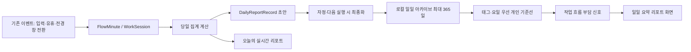

# FlowLens P1 작업 흐름 부담 신호 및 일일 리포트 설계

**대상 기능:** 비의료적 작업 흐름 부담 분석, 로컬 일일 요약 리포트, 개인 기준선 비교  
**대상 릴리스:** v0.7.0 제안  
**작성일:** 2026-09-18  
**작성자:** Manus AI

## 결론

P1은 사용자의 건강 상태나 의학적 피로를 추정하지 않는다. 대신 이미 수집하는 집중·유휴·세션·전환·입력 리듬 데이터를 이용해, **후반에 전환이 늘어났는지**, **휴식 뒤 흐름이 다시 안정되는 데 시간이 걸렸는지**, **긴 연속 활동이 반복되었는지**와 같은 **작업 흐름 부담 신호**를 설명한다. 보고서는 단일 점수 대신 각 신호의 원시 수치, 개인 기준선과의 차이, 해석의 불확실성을 함께 표시한다.

P1의 핵심 변경은 데이터 수집량을 크게 늘리는 것이 아니다. 현재 `FlowMinute`, `WorkSession`, `DailyFeatureVector`를 일자 전환 전에 **작은 불변 일일 아카이브**로 정리하고, 다음 날부터 해당 아카이브를 개인 기준선으로 사용하면 된다. 현재 `FlowMinute`은 당일 1,440개까지만 보관되고 일자 전환 시 초기화되므로, 과거 비교를 위한 일일 요약 레코드가 반드시 필요하다.[1]

> **표현 원칙:** P1은 “피로도 진단”, “집중력 저하”, “성과 저하”를 말하지 않는다. 대신 “후반 전환 밀도가 개인 기준보다 높았습니다”, “짧은 중단 뒤 안정적인 흐름까지 걸린 시간이 길었습니다”처럼 사용자가 수치로 검증할 수 있는 관찰만 제시한다.

## P1 범위와 제외 범위

P1의 기본 리포트는 당일의 흐름을 설명하고, 충분한 과거 기록이 있을 때만 개인 기준선과 비교한다. 기본 기능에는 새로운 관리자 권한, 알림 원문 접근, 앱별 네트워크 수집, 외부 AI 모델, 원격 저장소가 필요하지 않다. 앱은 기존처럼 로컬 Tauri IPC와 `activity.json`만 사용한다.[2]

| 기능 | P1 포함 | 설계 이유 |
|---|---:|---|
| 일일 집중·유휴·세션·전환 요약 | 예 | 현재 수집 데이터로 바로 계산 가능 |
| 후반 전환 변화 | 예 | `FlowMinute` 5분 버킷을 시간대별로 비교 가능 |
| 긴 연속 활동과 휴식 구조 | 예 | `WorkSession`과 유휴 구간으로 계산 가능 |
| 재진입 안정화 시간 | 예 | 새 집계형 `ReentryEpisode`를 추가해 계산 |
| 입력 리듬 변화 | 예, 보조 신호 | 키 내용 없이 밀도·변동성만 사용 |
| 선택적 업무 모드 태그 | 예 | 같은 유형의 날끼리 비교해 왜곡을 줄임 |
| 선택적 작업 흐름 만족도 1문항 | 예 | 모델 평가용 보조 레이블이며 기본값은 비활성 |
| 의료적 피로·번아웃·정신건강 판단 | 아니오 | 수집 데이터로 진단할 수 없고 과잉 해석 위험이 큼 |
| 수면, 심박, 생체 신호 | 아니오 | 수집 범위와 개인정보 민감도가 P1 목적을 초과함 |
| 알림 본문, 화면, 키 입력, URL, 패킷 | 아니오 | 리포트의 효용보다 침해 위험이 큼 |
| 자동 알림·외부 리포트 전송 | 아니오 | P1 리포트는 앱 내부에서만 사용자가 열람 |

## 현재 데이터와 P1의 데이터 공백

FlowLens는 활성 창을 200ms 간격으로 추적하고, 입력·유휴·전환 이벤트를 일 단위 상태에 합산한다. P0에서 추가된 `FlowMinute`은 분 단위 관측·집중·유휴 시간, 전환 수, 입력량을 보관하므로 5분 리본과 시간대별 통계의 원천이 된다. `WorkSession`은 활동 시간, 전환 수, 앱 수, 종료 사유를 제공한다.[1]

그러나 현재 날짜가 바뀌면 당일 상태가 초기화되고, 과거 날의 `FlowMinute` 및 세션 분포는 남지 않는다. 일일 임베딩은 최대 365일 보관되지만 24차원 벡터만으로는 “후반 전환 증가”나 “휴식 뒤 안정화 시간”의 근거를 다시 계산할 수 없다.[3] P1은 일자 전환 직전에 축약된 보고서 레코드를 아카이브해 이 공백을 해결한다.



## 용어와 해석 경계

| 용어 | P1에서의 의미 | 사용하지 않는 해석 |
|---|---|---|
| 작업 흐름 부담 신호 | 전환·재진입·연속 활동·입력 리듬에서 관측된 변화 | 건강 상태나 업무 능력의 판정 |
| 재진입 | 유휴로 닫힌 세션 뒤 새 활동 세션이 시작된 상황 | 휴식의 좋고 나쁨에 대한 일반화 |
| 안정화 | 재진입 뒤 연속 5분 이상 `focused` 버킷이 처음 형성된 시점 | 심리적 회복 또는 주의력 회복의 진단 |
| 개인 기준선 | 동일한 사용자에게서 충분히 축적된 과거 일일 레코드의 중앙값 | 인구 평균 또는 팀 평균 |
| 비교 불가 | 표본, 관측 범위, 태그가 부족한 상태 | 부정적인 결과 |

P1은 “피로도”라는 사용자 요구를 **작업 흐름의 부담·불안정 신호**로 좁혀서 구현한다. 사용자가 원하면 화면의 섹션 제목을 “오늘의 피로 신호”로 표시할 수 있으나, 내부 데이터 모델과 상세 문구는 항상 비의료적 용어를 사용한다. 이 구분은 오해를 줄이고, 사용자가 개별 수치와 신호를 삭제·비활성화하기 쉽게 만든다.

## 데이터 모델

### 1. 재진입 에피소드

현재 `resume_latency_seconds`는 마지막 입력 시점에 대한 단일 값이라, 여러 번의 유휴·재개를 비교하기에 부족하다. P1은 유휴로 종료된 세션과 다음 활동 세션의 관계만 집계하는 `ReentryEpisode`를 추가한다. 이 구조에는 앱 이름, 창 제목, 키 입력, URL을 넣지 않는다.

```rust
#[derive(Clone, Serialize, Deserialize, Default)]
#[serde(default)]
struct ReentryEpisode {
    // 유휴로 닫힌 직전 세션과 새 활동 세션을 연결하는 로컬 ID
    id: String,
    break_started_at: String,
    resumed_at: String,
    break_seconds: u64,

    // 재개 뒤 10분 동안의 집계값. 10분이 지나야 finalized = true가 된다.
    stabilization_seconds: Option<u64>,
    focused_seconds_first_10m: u16,
    switch_count_first_10m: u16,
    finalized: bool,
}
```

`stabilization_seconds`는 재개 시각 이후 첫 10분 안에 처음으로 **연속 5분 이상 `focused` 상태**가 나타날 때까지의 시간이다. 10분 동안 그런 구간이 없으면 `None`으로 남기고 “안정화 미관측”으로 집계한다. 이는 사용자가 일을 잘했는지를 판정하지 않는다. 단지 유휴 후 다시 시작된 흐름이 빠르게 연속 구간으로 바뀌었는지 확인한다.

`break_seconds`는 유휴 세션 종료 후 다음 세션 시작까지의 시간이다. P1은 3~60분 구간만 “분석 가능한 중단”으로 사용한다. 3분 미만은 짧은 전환에 가깝고, 60분 초과는 점심·퇴근·앱 종료 가능성이 높아 개인 비교에서 제외한다.

### 2. 일일 리포트 아카이브

`DailyReportRecord`는 원시 `FlowMinute`를 복제하지 않는다. 리포트 재생성과 개인 기준선에 필요한 **시간대별·세션별 요약값**과 설명 근거만 보관한다. 기본 보관 상한은 365일이다. 레코드 하나는 수 KB 수준으로 제한한다.

```rust
#[derive(Clone, Serialize, Deserialize, Default)]
#[serde(default)]
struct DailyReportRecord {
    schema_version: u32,
    date: String,
    generated_at: String,
    status: String, // draft | finalized
    data_quality: ReportDataQuality,
    context: DailyContext,
    metrics: DailyFlowMetrics,
    day_parts: Vec<DayPartMetrics>,
    reentry: ReentryMetrics,
    strain: FlowStrainAssessment,
    report: DailyReportContent,
}

#[derive(Clone, Serialize, Deserialize, Default)]
#[serde(default)]
struct ReportDataQuality {
    observed_minutes: u16,
    active_minutes: u16,
    observed_coverage: f32,
    session_count: u16,
    reentry_episode_count: u16,
    comparison_sample_count: u16,
    level: String, // insufficient | partial | sufficient
    limitations: Vec<String>,
}

#[derive(Clone, Serialize, Deserialize, Default)]
#[serde(default)]
struct DailyContext {
    work_mode_tag: Option<String>, // 구현 | 디버깅 | 문서화 | 검토 | 회의 | 학습 | 운영 대응
    reflection_enabled: bool,
    flow_satisfaction: Option<u8>, // 선택형 1~5. 건강 상태 질문이 아님.
}

#[derive(Clone, Serialize, Deserialize, Default)]
#[serde(default)]
struct DailyFlowMetrics {
    focus_seconds: u64,
    idle_seconds: u64,
    active_ratio: f32,
    work_span_minutes: u16,
    session_count: u16,
    median_session_seconds: u32,
    longest_session_seconds: u32,
    long_form_focus_share: f32,
    switch_count: u32,
    switches_per_active_hour: f32,
    short_session_share: f32,
    input_density_cv: Option<f32>,
}

#[derive(Clone, Serialize, Deserialize, Default)]
#[serde(default)]
struct DayPartMetrics {
    part: String, // morning | midday | afternoon | evening
    observed_seconds: u32,
    focus_seconds: u32,
    idle_seconds: u32,
    switch_count: u16,
    input_actions: u32,
    focused_bucket_share: f32,
    switches_per_active_hour: f32,
}

#[derive(Clone, Serialize, Deserialize, Default)]
#[serde(default)]
struct ReentryMetrics {
    analyzable_episode_count: u16,
    median_break_seconds: Option<u32>,
    median_stabilization_seconds: Option<u32>,
    stabilization_missing_share: Option<f32>,
    post_resume_switches_per_episode: Option<f32>,
}
```

`DailyReportContent`에는 계산값을 다시 해석한 문장과 근거 연결만 저장한다. 원본 창 제목·앱 이름·타임라인 제목을 보관하지 않는다. 화면 문구가 변경되어도 과거 레코드의 수치에서 리포트를 다시 생성할 수 있으므로, 장기적으로는 저장 문장을 최소화하고 `report_schema_version`과 신호 코드만 보관하는 편이 안전하다.

```rust
#[derive(Clone, Serialize, Deserialize, Default)]
#[serde(default)]
struct DailyReportContent {
    headline: String,
    highlights: Vec<ReportInsight>,
    observations: Vec<ReportInsight>,
    limitations: Vec<String>,
}

#[derive(Clone, Serialize, Deserialize, Default)]
#[serde(default)]
struct ReportInsight {
    code: String,
    level: String, // neutral | notice | positive
    title: String,
    detail: String,
    evidence: Vec<EvidenceValue>,
}

#[derive(Clone, Serialize, Deserialize, Default)]
#[serde(default)]
struct EvidenceValue {
    metric: String,
    value: f64,
    unit: String,
    baseline_median: Option<f64>,
    baseline_sample_count: u16,
}
```

### 3. 부담 신호 프로필

`FlowStrainAssessment`는 점수 하나가 아니라 최대 네 개의 독립 차원을 반환한다. UI는 4개의 막대 또는 2×2 카드로 표시하며, 각 차원은 `not_evaluated`, `within_personal_range`, `elevated`, `high` 상태를 가진다. 이 상태는 건강 위험 등급이 아니라 현재 일의 흐름이 개인 기준에서 얼마나 달랐는지를 나타낸다.

```rust
#[derive(Clone, Serialize, Deserialize, Default)]
#[serde(default)]
struct FlowStrainAssessment {
    eligible: bool,
    baseline: BaselineDescriptor,
    signals: Vec<FlowStrainSignal>,
    signal_count: u8,
}

#[derive(Clone, Serialize, Deserialize, Default)]
#[serde(default)]
struct BaselineDescriptor {
    cohort: String, // tag_weekday | tag | weekday | all_days | unavailable
    sample_count: u16,
    date_range_start: Option<String>,
    date_range_end: Option<String>,
}

#[derive(Clone, Serialize, Deserialize, Default)]
#[serde(default)]
struct FlowStrainSignal {
    code: String,
    label: String,
    state: String, // not_evaluated | within_personal_range | elevated | high
    current_value: Option<f64>,
    baseline_median: Option<f64>,
    robust_delta: Option<f32>,
    evidence: Vec<EvidenceValue>,
    explanation: String,
}
```

## 수집기와 일자 전환 변경

### 재진입 에피소드 생성

유휴로 세션이 닫힐 때 앱은 새 `pending_reentry` 상태를 만든다. 이 상태에는 휴식 시작 시각과 종료된 세션의 로컬 ID만 둔다. 새 활동 세션이 시작되면 `break_seconds`를 계산하고, 3~60분 범위일 때만 `ReentryEpisode`를 생성한다. 이후 10분 동안 기존 `FlowMinute`으로 집중·전환 값을 누적하고, 5분 연속 `focused` 구간의 시작을 찾는다.

```text
idle session close
  -> pending_reentry.break_started_at = now

next active session start
  -> break_seconds = now - pending_reentry.break_started_at
  -> 3분 <= break_seconds <= 60분이면 ReentryEpisode 생성
  -> 다음 10분 동안 5분 버킷 상태와 전환 수를 추적
  -> 첫 focused 연속 5분을 찾으면 stabilization_seconds 기록
  -> 10분 경과 시 episode finalized
```

재진입 분석은 앱이 닫혀 있거나 추적이 일시 정지된 사이의 행동을 알 수 없다. 따라서 `tracking_paused` 종료 사유와 60분 초과 공백은 분석 대상에서 제외한다. 리포트에는 이 한계를 `limitations`로 명시한다.

### 일일 리포트 최종화

`rollover_if_needed`의 현재 순서는 이전 일의 임베딩을 만든 뒤 당일 상태를 초기화한다. P1은 초기화 전에 다음 순서를 추가한다.

```text
1. 이전 날짜의 진행 중 세션을 end_reason = day_rollover로 닫는다.
2. 열려 있는 ReentryEpisode를 finalized 상태로 마감한다.
3. FlowMinute, WorkSession, ReentryEpisode로 DailyReportRecord를 생성한다.
4. 기준선은 이전에 finalized 된 아카이브만 사용해 계산한다.
5. DailyReportRecord를 daily_reports에 upsert한다.
6. 임베딩을 업데이트한다.
7. 당일 상태와 FlowMinute를 초기화한다.
```

앱이 자정에 실행 중이지 않아도 문제없다. 다음 실행 시 또는 다음 추적 루프에서 `rollover_if_needed`가 감지되면 이전 일의 `activity.json` 상태를 사용해 최종 리포트를 생성한다. 당일은 `draft` 상태로 5분 또는 15분 단위로 미리보기만 갱신한다. 하루가 끝나기 전에는 개인 기준선에 당일 초안을 포함하지 않는다.

### 저장과 보존

`TrackingState`에는 아래 필드를 추가한다. 모든 필드는 `#[serde(default)]`를 사용해 기존 `activity.json`을 읽을 수 있게 한다.

```rust
const MAX_DAILY_REPORTS: usize = 365;
const MAX_REENTRY_EPISODES: usize = 64;

struct TrackingState {
    // 기존 필드
    reentry_episodes: Vec<ReentryEpisode>,
    pending_reentry: Option<PendingReentry>,
    daily_reports: Vec<DailyReportRecord>,
    report_settings: ReportSettings,
}

#[derive(Clone, Serialize, Deserialize, Default)]
#[serde(default)]
struct ReportSettings {
    enabled: bool,
    work_mode_tag: Option<String>,
    reflection_enabled: bool,
    reminder_enabled: bool, // 기본 false. 외부 전송 없이 앱 내부 배지만 표시.
}
```

`daily_reports`는 날짜 오름차순으로 유지하고 365개를 초과하면 가장 오래된 finalized 레코드부터 제거한다. 당일 `draft`는 1개만 존재한다. 원시 `FlowMinute`는 여전히 당일 1,440개만 보관한다. 이 구조는 1년의 비교 이력을 제공하면서도 분 단위 원시 기록을 장기 보관하지 않는다.

## 일일 지표 계산

### 데이터 품질 게이트

리포트는 어떤 신호보다 먼저 관측 품질을 계산한다. 데이터가 적을 때는 “부담 신호 없음”이 아니라 **비교 불가**로 표시한다.

| 수준 | 조건 | 리포트 동작 |
|---|---|---|
| `insufficient` | 관측 시간 60분 미만 또는 5분 버킷 12개 미만 | 사실 요약만 표시하고 모든 비교 신호를 `not_evaluated`로 둠 |
| `partial` | 관측 시간 60~119분 또는 세션 2개 미만 | 기본 흐름 요약과 당일 비교만 표시하고 기준선 문구를 제한 |
| `sufficient` | 관측 시간 120분 이상, 관측 범위 60% 이상, 완료 세션 2개 이상 | 기준선 비교와 부담 신호를 허용 |

관측 범위는 첫 번째 관측 버킷부터 마지막 관측 버킷까지의 시간에서 실제 관측 초가 차지하는 비율이다. 앱이 백그라운드에 있었거나 추적이 정지된 시간이 길면 이 값이 낮아진다.

### 기본 흐름 지표

| 지표 | 계산 | 일일 리포트 역할 |
|---|---|---|
| 집중 시간 | `FlowMinute.focus_seconds` 합계 | 당일 활동의 기본 규모 |
| 유휴 시간 | `FlowMinute.idle_seconds` 합계 | 세션 사이 중단의 규모 |
| 활성 비율 | `focus / (focus + idle)` | 집중·유휴 구성 설명 |
| 중앙 세션 길이 | 완료 세션의 활성 시간 중앙값 | 한 번에 유지된 흐름의 대표값 |
| 최장 세션 | 최대 활성 세션 길이 | 연속 활동 구간 설명 |
| 롱폼 집중 비율 | 25분 이상 세션의 활성 시간 / 총 활성 시간 | 긴 세션의 비중 |
| 짧은 세션 비율 | 10분 미만 세션 수 / 전체 세션 수 | 짧게 끊긴 구조의 비중 |
| 전환 밀도 | `switch_count / active_hours` | 앱 전환의 상대적 빈도 |
| 입력 리듬 변동 | 5분 입력 밀도의 변동계수 | 보조적인 작업 방식 변화 |

입력 리듬은 보고서의 주된 부담 신호가 아니다. 낮은 입력은 읽기·검토·회의처럼 정상적인 작업 형태일 수 있다. 따라서 입력 지표는 전환 증가 또는 재진입 지연과 함께 있을 때만 설명 근거로 사용한다.[4]

### 시간대 구분

P1은 고정된 4개 구간을 사용한다. 시간대별 결과는 개인 일정에 대해 판단하지 않고, 하루 안에서 흐름이 어떻게 달라졌는지 설명하는 용도다.

| 구간 | 로컬 시간 | 비교 지표 |
|---|---|---|
| `morning` | 05:00~10:59 | 집중 비율, 전환 밀도, 입력 밀도 |
| `midday` | 11:00~13:59 | 집중 비율, 전환 밀도, 유휴 비율 |
| `afternoon` | 14:00~17:59 | 집중 비율, 전환 밀도, 재진입 후 흐름 |
| `evening` | 18:00~04:59 | 집중 비율, 전환 밀도, 작업 범위 맥락 |

사용자가 야간에 작업한다고 해서 P1은 부정적 신호를 만들지 않는다. `evening`은 시간대 맥락을 보여 줄 뿐이며, 확장된 작업 시간은 기본 부담 신호에 포함하지 않는다.

## 개인 기준선 설계

### 코호트 선택

기준선은 무조건 전체 평균을 사용하지 않는다. 먼저 같은 선택 태그와 같은 요일을 찾고, 표본이 부족하면 한 단계씩 넓힌다. 이는 회의 중심 날과 구현 중심 날을 같은 기준으로 비교하는 왜곡을 줄인다.[4]

| 우선순위 | 코호트 | 최소 finalized 레코드 | 화면 표시 |
|---:|---|---:|---|
| 1 | 동일 업무 모드 태그 + 동일 요일 | 8 | “동일 업무 모드·요일 기준” |
| 2 | 동일 업무 모드 태그 | 10 | “동일 업무 모드 기준” |
| 3 | 동일 요일 | 10 | “동일 요일 기준” |
| 4 | 태그와 요일 무관한 전체 | 14 | “개인 전체 기준” |
| 5 | 없음 | 0 | “기준선 학습 중” |

비교 후보는 최근 56일의 finalized 리포트만 사용한다. `data_quality.level != sufficient`인 날과 수동으로 삭제된 리포트는 제외한다. 동일 날짜의 초안은 포함하지 않는다.

### 강건한 차이 계산

기준선의 중심값은 평균이 아니라 중앙값을 사용한다. 변동 폭은 중앙값 절대편차(MAD)로 구한다. 극단적인 회의일이나 비정상적으로 짧은 추적일이 기준선을 크게 흔드는 문제를 줄이기 위해서다.

```text
median = median(priorValues)
mad = median(abs(priorValues - median))
robustScale = max(1.4826 * mad, metricFloor)
robustDelta = (currentValue - median) / robustScale
```

각 지표의 `metricFloor`는 작은 분모에서 차이가 과장되는 것을 막는다. 예를 들어 전환 밀도는 시간당 1회, 안정화 시간은 60초, 롱폼 집중 비율은 0.08을 하한으로 둔다. 신호가 `elevated`가 되려면 절대 `robustDelta`가 1.0 이상이고, `high`가 되려면 1.75 이상이어야 한다. 단일 지표가 `high`여도 보고서 헤드라인은 평가적 표현을 사용하지 않는다.

## 작업 흐름 부담 신호 규칙

P1은 다음 네 가지 신호만 기본 제공한다. 각 신호는 서로 다른 데이터를 사용하므로, 하나의 신호가 관찰되어도 다른 신호까지 추정하지 않는다.

| 코드 | 측정값 | `elevated` 조건 | `high` 조건 | 사용자 문구 예시 |
|---|---|---|---|---|
| `late_fragmentation` | 후반 전환 밀도와 오전 대비 변화 | 후반 전환 밀도가 기준선보다 1.0 robust delta 이상 높고, 후반 관측 45분 이상 | 1.75 이상이며 오전보다 30% 이상 증가 | “오후 전환 밀도가 개인 기준보다 높게 기록되었습니다.” |
| `reentry_friction` | 재진입 안정화 시간, 재개 후 10분 전환 수 | 분석 가능한 재진입 2회 이상, 중앙 안정화 시간이 기준선보다 1.0 이상 길거나 미관측 비율 50% 이상 | 1.75 이상이며 재개 후 전환 수가 함께 증가 | “중단 뒤 연속 흐름이 형성되기까지의 시간이 평소보다 길었습니다.” |
| `extended_unbroken_flow` | 90분 이상 연속 활성 흐름 수와 롱폼 비율 | 90분 이상 세션이 1개 이상이고, 그 뒤 15분 미만 중단이 반복 | 2개 이상이거나 개인 기준선보다 1.75 이상 큼 | “긴 연속 활동 구간이 평소보다 많이 기록되었습니다.” |
| `rhythm_volatility` | 5분 입력 밀도 변동과 전환 밀도 동반 변화 | 입력 변동이 기준선보다 1.0 이상 크고 전환 밀도도 상승 | 두 값 모두 1.75 이상 | “후반 상호작용 리듬과 앱 전환이 함께 크게 변했습니다.” |

`extended_unbroken_flow`는 길게 일한 것이 부정적이라는 뜻이 아니다. 리포트는 “휴식이 부족했다” 같은 결론 대신, 긴 연속 활동의 시간과 세션 구조만 보여 준다. 사용자가 리포트를 검토할 때 맥락을 직접 판단하도록 한다.

`rhythm_volatility`는 저입력 작업을 피로로 해석하지 않도록 반드시 전환 상승과 함께 있어야 한다. 입력량만 낮거나 변동만 큰 경우에는 정량 지표로만 남기고 신호를 만들지 않는다.

### 헤드라인 규칙

헤드라인은 신호 개수와 품질에 따라 정해진 문구만 사용한다.

| 조건 | 헤드라인 |
|---|---|
| `insufficient` | “오늘의 기록을 더 모으면 흐름 요약을 만들 수 있습니다.” |
| 기준선 없음 | “오늘의 작업 흐름을 기록했습니다. 개인 기준선은 더 쌓인 뒤 비교합니다.” |
| 신호 0개 | “오늘의 흐름은 현재 개인 기준선 범위에서 기록되었습니다.” |
| 신호 1개 | “오늘의 흐름에서 확인할 변화 신호가 1개 있습니다.” |
| 신호 2개 이상 | “오늘의 후반 작업 흐름에서 여러 변화 신호가 함께 기록되었습니다.” |

“피로가 높습니다”, “휴식이 필요합니다”, “집중력이 떨어졌습니다”는 어떤 경우에도 자동 생성하지 않는다. 조언이 필요한 경우에도 선택지로 “세션과 전환 흐름을 다시 보기” 정도만 제공한다.

## 일일 리포트 생성 절차

```text
입력: 현재 날짜의 FlowMinute, WorkSession, ReentryEpisode, 사용자 선택 태그·자가 평가

1. 관측 품질 계산
2. FlowMinute를 5분 버킷 및 4개 시간대로 집계
3. 세션 분포·롱폼 비율·짧은 세션 비율 계산
4. 재진입 에피소드의 안정화·전환 값을 계산
5. finalized 된 과거 DailyReportRecord로 기준선 코호트 선택
6. 각 부담 신호의 robust delta와 상태 계산
7. 수치 근거를 포함한 중립적 리포트 카드 생성
8. 당일은 draft 저장, 날짜 전환 시 finalized 저장
```

### Rust 어댑터 개요

일일 리포트 작성기는 추적 루프가 아닌 현재 상태를 잠깐 복제한 뒤 계산해야 한다. 50ms 및 200ms 수집 루프에서 복잡한 기준선 계산을 수행하면 입력 추적 지연이 생길 수 있다. 따라서 5분 경계, 사용자의 명시적 “오늘 요약 보기”, 날짜 전환 시점에만 `build_daily_report`를 호출한다.

```rust
fn build_daily_report(
    state: &TrackingState,
    date: &str,
    status: ReportStatus,
    now: chrono::DateTime<chrono::Local>,
) -> DailyReportRecord {
    let quality = assess_report_data_quality(state, date);
    let metrics = aggregate_daily_flow_metrics(state, date);
    let day_parts = aggregate_day_parts(state, date);
    let reentry = aggregate_reentry_metrics(state, date);
    let baseline = select_baseline(&state.daily_reports, &state.report_settings, date, &quality);
    let strain = assess_flow_strain(&metrics, &day_parts, &reentry, baseline, &quality);
    let report = render_daily_report_content(&quality, &metrics, &day_parts, &reentry, &strain);

    DailyReportRecord {
        schema_version: 1,
        date: date.into(),
        generated_at: now.to_rfc3339(),
        status: status.as_str().into(),
        data_quality: quality,
        context: current_daily_context(state),
        metrics,
        day_parts,
        reentry,
        strain,
        report,
    }
}
```

리포트 본문은 계산 결과로부터 결정적으로 생성한다. 외부 LLM, 텍스트 생성 API, 원격 데이터베이스를 호출하지 않는다. 언어별 문구는 앱 번들에 포함된 템플릿 테이블로 관리한다.

## Tauri IPC 계약

P1은 전체 `TrackingState`를 프론트엔드에서 다시 분석하지 않는다. 보고서 전용의 작은 읽기 모델과 설정 명령만 노출한다.

```rust
#[tauri::command]
fn get_daily_report(
    date: String,
    include_draft: bool,
    state: tauri::State<'_, SharedState>,
) -> Result<DailyReportRecord, String>;

#[tauri::command]
fn get_daily_report_history(
    limit: u16,
    state: tauri::State<'_, SharedState>,
) -> Result<Vec<DailyReportListItem>, String>;

#[tauri::command]
fn set_daily_work_mode_tag(
    tag: Option<String>,
    state: tauri::State<'_, SharedState>,
    path: tauri::State<'_, SharedPath>,
) -> Result<DailyContext, String>;

#[tauri::command]
fn set_flow_reflection(
    value: Option<u8>,
    state: tauri::State<'_, SharedState>,
    path: tauri::State<'_, SharedPath>,
) -> Result<DailyContext, String>;

#[tauri::command]
fn clear_daily_report_history(
    state: tauri::State<'_, SharedState>,
    path: tauri::State<'_, SharedPath>,
) -> Result<(), String>;
```

`date`는 P1에서 archived reports의 날짜와 현재 `collection_day`만 허용한다. 임의 범위 조회나 원시 분 버킷의 장기 노출은 지원하지 않는다. `set_daily_work_mode_tag`는 사전 정의된 값만 허용하고 자유 텍스트는 거부한다.

```text
구현 | 디버깅 | 문서화 | 검토 | 회의 | 학습 | 운영 대응 | 미지정
```

`set_flow_reflection`은 1~5 정수 또는 `None`만 받는다. 값의 질문 문구는 “오늘 작업 흐름에 얼마나 만족했나요?”로 한정하며, 건강·기분·수면·스트레스의 자가 평가를 묻지 않는다. 기본값은 비활성이고, 사용자가 설정에서 먼저 켜야 한다.

## 일일 리포트 UI 구조

리포트는 별도 **오늘 요약** 탭으로 제공한다. 앱이 외부 알림을 보내지 않으므로, 사용자는 대시보드에서 직접 열거나 하루 종료 뒤 다음 실행 시 확인한다. 리포트의 모든 강조 문구에는 “근거 보기” 토글이 있어 원시 콘텐츠가 아닌 수치 근거를 보여 준다.

```text
DailyReportPanel
├── ReportHeader
│   ├── 날짜, draft/finalized 상태
│   ├── 데이터 품질 배지
│   └── 기준선 코호트 설명
├── FlowSummary
│   ├── 집중 시간, 활성 비율, 세션 중앙값
│   └── 오늘의 중립적 헤드라인
├── WorkloadSignalGrid
│   ├── 후반 전환 변화
│   ├── 재진입 흐름
│   ├── 긴 연속 활동
│   └── 상호작용 리듬 변화
├── DayPartComparison
│   └── 오전·정오·오후·저녁의 집중/전환 비교
├── EvidenceDrawer
│   └── 현재값, 개인 중앙값, 표본 수, 한계
├── OptionalContextControls
│   ├── 업무 모드 태그
│   └── 작업 흐름 만족도 1문항
└── PrivacyAndDeleteControls
    ├── 오늘 리포트 삭제
    ├── 리포트 이력만 삭제
    └── 전체 수집 데이터 삭제
```

기본 화면은 신호가 없더라도 `FlowSummary`를 표시한다. 기준선이 부족하면 신호 카드 대신 “개인 기준선 학습 중”과 필요한 최소 기록 수를 보여 준다. 사용자가 태그를 선택하지 않았다면 태그 입력을 반복해서 요구하지 않는다.

### 시각화 규칙

P1에는 의료적 게이지, 빨간 경고계, 0~100 피로도 원형 차트를 사용하지 않는다. 대신 네 가지 독립 신호에 대해 회색·보라·주황 계열의 단계형 막대를 사용한다. `high` 상태도 빨강이 아니라 대비가 높은 주황으로 표시하며, 상태명과 수치 근거를 항상 함께 노출한다.

시간대 비교는 P0 리본과 같은 5분 흐름 데이터를 기반으로 하지만, 리포트에는 4개 시간대의 요약 막대만 표시한다. 사용자가 필요할 때만 P0 리본의 해당 시간대로 이동할 수 있다.

## 삭제와 개인정보 보호

일일 리포트는 분석 데이터다. 원천 활동 데이터와 삭제 범위를 분리해야 사용자가 보고서 이력만 지울 수 있다.

| 작업 | 삭제 대상 | 유지 대상 |
|---|---|---|
| 오늘 리포트 삭제 | 당일 `DailyReportRecord` 초안 또는 finalized 레코드, 당일 태그·자가 평가 | 현재 추적 상태와 원천 FlowMinute |
| 리포트 이력 전체 삭제 | `daily_reports`, `reentry_episodes`, 기준선·자가 평가·태그 이력 | 현재 추적 상태, 앱 집계, 임베딩 이력 |
| 임베딩 데이터 삭제 | 기존 임베딩 이력만 | 일일 리포트 이력과 원천 추적 데이터 |
| 전체 데이터 삭제 | 모든 원천 추적, 리포트, 재진입, 태그, 자가 평가, 임베딩 | 어떤 사용자 활동 데이터도 유지하지 않음 |

리포트만 삭제한 뒤에도 미래 리포트는 현재 원천 데이터에서 다시 생성될 수 있다. 이 동작을 삭제 확인 창에 명확히 표시한다. 사용자가 앞으로 리포트를 만들지 않으려면 `ReportSettings.enabled = false`로 끌 수 있어야 한다.

P1 데이터에는 창 제목·앱 이름·URL·키 코드·키 입력 문자열·마우스 좌표·화면·알림 내용·패킷·IP가 포함되지 않는다. 리포트 비교를 위한 업무 모드 태그도 미리 정의된 범주만 허용한다. 이 경계는 기존 로컬 저장 및 외부 전송 부재 원칙을 유지한다.[2] [3]

## 테스트 계획

### Rust 단위 테스트

| 테스트 | 검증 내용 |
|---|---|
| 일자 전환 리포트 최종화 | 이전 일의 draft가 한 번만 finalized 되고 다음 날짜 상태가 초기화되는지 확인 |
| 재진입 에피소드 범위 | 3~60분 유휴만 분석 대상에 들어가고, 추적 일시 정지·장기 공백이 제외되는지 확인 |
| 안정화 시간 | 재진입 뒤 5분 연속 focused 버킷을 정확히 탐지하고, 10분 내 미관측 시 `None`이 되는지 확인 |
| 데이터 품질 게이트 | 관측 60분 미만에서 기준선 비교와 부담 신호가 모두 비활성화되는지 확인 |
| 기준선 코호트 | 태그·요일, 태그, 요일, 전체 순서로 최소 표본을 지켜 선택하는지 확인 |
| 강건한 차이 계산 | MAD가 0인 경우 `metricFloor`가 적용되고 극단값이 평균을 왜곡하지 않는지 확인 |
| 신호 독립성 | 입력 변동만으로는 `rhythm_volatility`가 생성되지 않고 전환 증가가 함께 필요함을 확인 |
| 보존과 삭제 | 365개 상한, 리포트 이력 삭제, 전체 삭제의 범위가 서로 다른지 확인 |

### UI 테스트

리포트 화면은 기준선이 없는 경우, 품질이 낮은 경우, 신호가 없는 경우, 하나 또는 여러 신호가 있는 경우를 각각 렌더링해야 한다. 모든 신호 카드는 현재값·중앙값·표본 수를 읽을 수 있어야 하며, 색상 없이도 상태를 구분하는 텍스트와 ARIA 라벨을 제공해야 한다.

### 수동 검수 시나리오

1. 2시간 이상 활동하고 2개 이상의 완료 세션을 만들면 당일 `draft` 리포트가 생성된다.
2. 다음 로컬 날짜에 앱을 실행하면 전날 리포트가 `finalized`로 저장되고, 당일 상태는 빈 리포트로 시작한다.
3. 14개 이상의 충분한 과거 리포트를 준비하면 기준선 코호트와 표본 수가 화면에 표시된다.
4. 유휴 후 재개 뒤 5분 연속 집중 구간을 만들면 안정화 시간이 계산된다.
5. 리포트 이력만 삭제하면 임베딩과 현재 추적 데이터가 유지되는지, 전체 삭제하면 모두 제거되는지 확인한다.
6. 네트워크 검사에서 `fetch`, WebSocket, HTTP 클라이언트, 분석 SDK, 외부 모델 API가 추가되지 않았는지 확인한다.

## 단계적 구현 순서

첫 번째 구현은 저장 모델이다. `ReentryEpisode`, `DailyReportRecord`, `daily_reports`, `ReportSettings`를 `TrackingState`에 추가하고 `serde(default)`로 이전 데이터 파일과 호환되게 한다. 두 번째 구현은 유휴 종료·활동 재개·5분 버킷 상태를 이용한 재진입 에피소드 추적이다.

세 번째 구현은 `build_daily_report`와 데이터 품질, 시간대 집계, 세션 분포, 기준선 선택, 강건한 차이 계산이다. 이 단계에서는 리포트를 생성하되 UI가 없어도 Rust 단위 테스트로 JSON 계약과 삭제 동작을 고정한다. 네 번째 구현은 Tauri IPC, 오늘 요약 화면, 근거 드로어, 태그와 선택형 자가 평가 제어다.

마지막 단계는 하루 전환과 앱 재실행에서 리포트 최종화가 정확히 한 번만 일어나는지 검증하고, Windows MSI/EXE 빌드에서 로컬 저장 경계를 재점검하는 것이다. 외부 전송 또는 자동 알림을 추가하지 않은 상태에서 P1을 출시한다.

## 완료 기준

P1은 아래 조건을 모두 만족할 때 완료로 본다.

- 모든 부담 신호가 원시 콘텐츠 없이 계산되고, 카드마다 수치 근거와 기준선 표본 수를 제공한다.
- 데이터 품질이나 기준선 표본이 부족하면 신호를 만들지 않고 비교 불가 사유를 표시한다.
- 기본 리포트가 하나의 피로·생산성·건강 점수로 합쳐지지 않는다.
- 리포트 이력, 선택 태그·자가 평가, 전체 수집 데이터의 삭제 범위가 분리되어 동작한다.
- 기준선은 finalized 된 과거 로컬 레코드만 사용하며, 외부 API·원격 데이터베이스·LLM·분석 SDK를 호출하지 않는다.
- Windows 릴리스 워크플로에서 리포트 집계·기준선·삭제 Rust 단위 테스트와 Tauri 설치파일 빌드가 모두 통과한다.

## References

[1]: https://github.com/jinbhum/FlowLens/blob/v0.6.0/src-tauri/src/lib.rs "FlowLens v0.6.0 tracker, FlowMinute buckets, work sessions, and local focus aggregation"

[2]: https://github.com/jinbhum/FlowLens/blob/v0.6.0/SECURITY.md "FlowLens v0.6.0 local-only security review and data collection boundary"

[3]: https://github.com/jinbhum/FlowLens/blob/v0.6.0/LOCAL_EMBEDDING.md "FlowLens v0.6.0 local work-pattern embedding design and retention boundary"

[4]: https://github.com/jinbhum/FlowLens/blob/v0.6.0/PATTERN_ANALYTICS_ROADMAP.md "FlowLens work-pattern analysis roadmap and interpretation safeguards"
